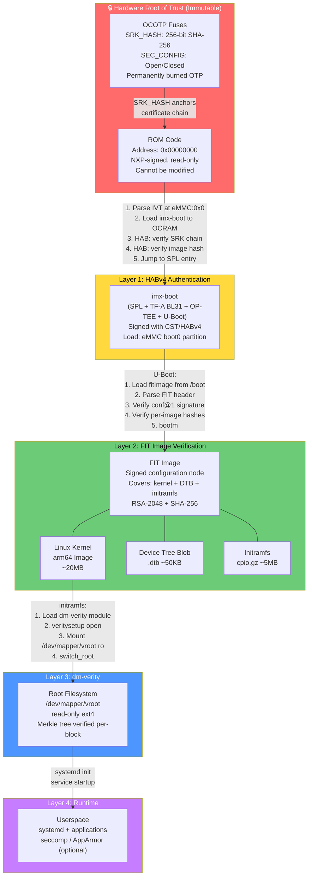

# Chain of Trust Diagrams

## Mermaid: Complete Chain of Trust



---

## ASCII: Verification Detail Per Stage

```
POWER ON RESET
     │
     ▼
┌─────────────────────────────────────────────────────────┐
│  ROM CODE (0x00000000, OCRAM)                            │
│  ─────────────────────────                              │
│  1. Read BOOT_MODE pins                                  │
│  2. Detect boot device (eMMC/SD/SPI)                    │
│  3. Read IVT at offset 0x0 (eMMC boot0)                 │
│  4. HABv4: install_SRK(fuses.SRK_HASH)                  │
│  5. HABv4: verify_CSF(IVT→CSF pointer)                  │
│  6. HABv4: verify_image(IVT→entry, CSF→blocks)          │
│                                                         │
│  IF SEC_CONFIG=CLOSED AND verification fails:           │
│  ──────────────────────────────────────────             │
│  → HALT (no boot, no error output)                      │
│                                                         │
│  IF verification OK:                                    │
│  ─────────────────                                      │
│  → Jump to SPL entry point                              │
└─────────────────────────────────────────────────────────┘
     │
     ▼
┌─────────────────────────────────────────────────────────┐
│  SPL (OCRAM, ~128KB)                                    │
│  ──────────────────                                     │
│  1. Early UART init                                     │
│  2. DDR training and initialization (~500ms)            │
│  3. Load FIT (SPL FIT) from eMMC boot0                  │
│  4. FIT signature verify (if CONFIG_SPL_FIT_SIGNATURE)  │
│  5. Extract: BL31 + OP-TEE + U-Boot from FIT            │
│  6. Jump to TF-A BL31                                   │
└─────────────────────────────────────────────────────────┘
     │
     ▼
┌─────────────────────────────────────────────────────────┐
│  TF-A BL31 (EL3, 0x960000)                             │
│  ──────────────────────────                             │
│  1. EL3 Secure Monitor setup                            │
│  2. GIC initialization                                  │
│  3. TZASC: configure Secure/NS DRAM regions             │
│  4. Start OP-TEE (BL32) at EL1-Secure                   │
│  5. Transfer control to U-Boot (BL33) via PSCI          │
│  [Stays resident at EL3 for SMC handling]               │
└─────────────────────────────────────────────────────────┘
     │
     ▼
┌─────────────────────────────────────────────────────────┐
│  U-BOOT (EL1-NS, 0x40200000)                            │
│  ───────────────────────────                            │
│  1. Full board init (MMC, USB, net probed)              │
│  2. load mmc 2:1 ${fit_addr} fitImage                   │
│  3. fit_check_format(fit): validate FIT header          │
│  4. fit_image_verify_required_sigs(fit, "conf@1")       │
│     → RSA-2048 verify against embedded public key       │
│     → SHA-256 verify each image node                    │
│  5. IF verification FAILS: HALT                         │
│  6. bootm ${fit_addr}: prepare boot args, jump kernel   │
└─────────────────────────────────────────────────────────┘
     │
     ▼
┌─────────────────────────────────────────────────────────┐
│  LINUX KERNEL (EL1-NS, 0x40480000)                      │
│  ──────────────────────────────────                     │
│  1. ARM64 startup, device tree parse                    │
│  2. Drivers init (MMC, crypto, etc.)                    │
│  3. initramfs execution                                 │
│  4. veritysetup open /dev/mmcblk2p2 vroot               │
│     /dev/mmcblk2p4 <root-hash>                          │
│  5. mount /dev/mapper/vroot /sysroot -o ro              │
│  6. switch_root /sysroot /sbin/init                     │
└─────────────────────────────────────────────────────────┘
     │
     ▼
┌─────────────────────────────────────────────────────────┐
│  ROOT FILESYSTEM (dm-verity protected)                  │
│  ─────────────────────────────────────                  │
│  Every 4096-byte block read:                            │
│  1. dm-verity computes SHA-256(block)                   │
│  2. Compares vs Merkle tree leaf hash                   │
│  3. Verifies up tree to root hash                       │
│  4. Root hash vs stored value                           │
│  5. Mismatch → I/O error (or panic in prod mode)        │
└─────────────────────────────────────────────────────────┘
```

---

## Key Material Used At Each Stage

```
Stage         | Key Used                    | Key Location
─────────────────────────────────────────────────────────────
ROM → SPL     | SRK→CSF→IMG certificate     | OCOTP fuses (SRK hash)
SPL → U-Boot  | IMG key (HAB continued)     | OCOTP fuses (SRK hash)
U-Boot → FIT  | FIT signing key (RSA-2048)  | U-Boot DTB (embedded at build time)
Kernel → FS   | None (hash comparison)      | Kernel cmdline / FIT config
```

---

## Failure Impact Analysis

```
Failure Point          | OPEN Mode Impact    | CLOSED Mode Impact
───────────────────────────────────────────────────────────────────
Wrong SRK in fuses     | HAB warning, boots  | PERMANENT BRICK
imx-boot not signed    | HAB warning, boots  | HALT at ROM
imx-boot wrong sig     | HAB warning, boots  | HALT at ROM
FIT not signed         | Boot if required=N  | HALT at U-Boot
FIT wrong signature    | HALT (if required)  | HALT at U-Boot
Wrong root hash        | I/O errors          | I/O errors / panic
Rootfs tampered        | I/O errors          | I/O errors / panic
```

Note: dm-verity errors are the same in OPEN and CLOSED mode — they are enforced by the Linux kernel, not HABv4.
