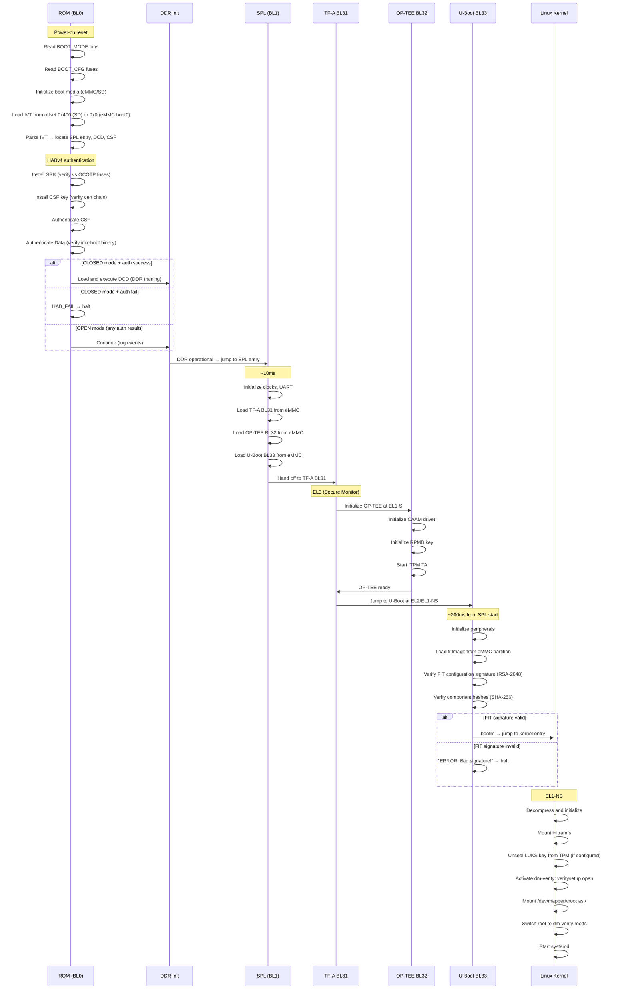

# i.MX8MP Boot Flow Diagram

## Boot Sequence



## Timing Reference

| Stage | Typical Duration | Notes |
|-------|-----------------|-------|
| ROM + DDR init | 500ms–2s | DDR training is slow |
| SPL | 50–200ms | Loading TF-A + OP-TEE + U-Boot |
| TF-A/OP-TEE init | 100–300ms | CAAM init, RPMB key |
| U-Boot | 200ms–2s | Depends on env, FIT load |
| Linux boot | 3–15s | Depends on rootfs size, init |
| **Total** | **4–20s** | Optimize if needed |

## Memory Map at Boot

```
0x00000000 ┌─────────────────────────────┐
           │  ROM (read-only)             │  ~96KB
0x00017FFF └─────────────────────────────┘
           ...
0x7E1000   ┌─────────────────────────────┐
           │  SPL (loaded by ROM)         │  ~256KB max
0x821000   └─────────────────────────────┘
           ...
0x40000000 ┌─────────────────────────────┐
           │  DDR (start)                 │
           │  TF-A BL31: 0x40000000      │  ~512KB
           │  OP-TEE:    0x56000000      │  ~2MB
           │  U-Boot:    0x40400000      │  ~1.5MB
           │  U-Boot DTB: 0x43000000     │  ~64KB
           │  FIT image:  0x50000000     │  ~25MB
           │  Kernel:     0x40480000     │  ~20MB
           │  DTB:        0x43000000     │  ~64KB
           │  Ramdisk:    0x44000000     │  ~5MB
0xC0000000 └─────────────────────────────┘
           DDR end (1GB configuration)
```
