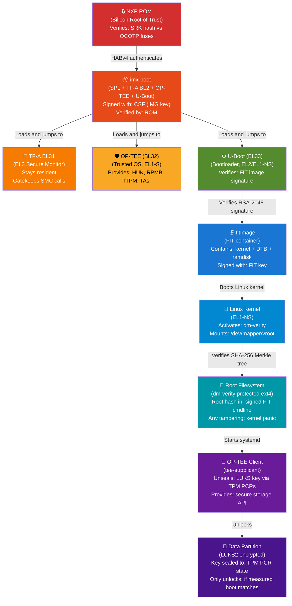

# Chain of Trust Diagram

## Complete Trust Chain



## Trust Relationships Table

| Verifier | Verified | Method | Key Material |
|----------|---------|--------|-------------|
| ROM | imx-boot | HABv4 RSA-2048 | SRK hash in OCOTP fuses |
| U-Boot | fitImage | FIT RSA-2048 | Public key in U-Boot DTB |
| Linux kernel | rootfs blocks | dm-verity SHA-256 | Root hash in signed cmdline |
| Kernel | OP-TEE | TrustZone hardware | None — HW enforced |
| Application | data | LUKS2 AES-256 | Key sealed in TPM |

## Failure Modes

```
Failure at ROM/HABv4:
  CLOSED mode → Device halts, no output
  OPEN mode   → HAB event logged, boot continues (development only)

Failure at U-Boot/FIT:
  "ERROR: Bad signature!" → Boot halts
  No recovery without reflash

Failure at dm-verity:
  Any tampered block → kernel panic (production: panic_on_corruption)
  Device reboots, enters recovery if A/B partitions available

Failure at TPM unseal:
  Data partition inaccessible
  Recovery: passphrase entry or re-seal
```
