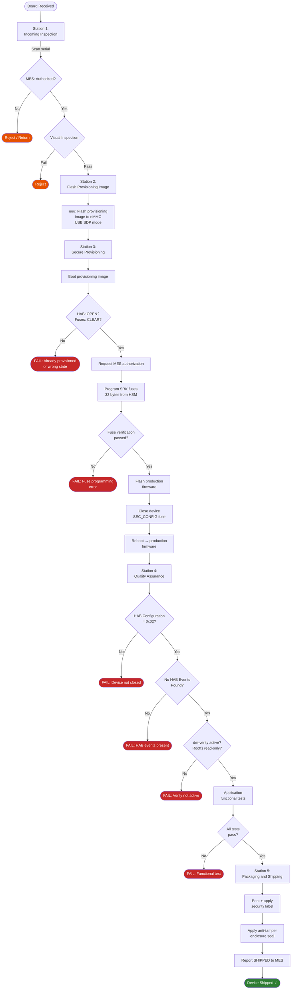

# Manufacturing Flow Diagram

## Factory Station Flow



## Parallel Station Throughput

```
Typical station times:
  Station 1 (Incoming):    1 min/board
  Station 2 (Flash prov):  3 min/board
  Station 3 (Provision):   8 min/board  ← bottleneck
  Station 4 (QA):          5 min/board
  Station 5 (Pack):        1 min/board

For 500 boards/day:
  Station 3 needed: 500 × 8min = 4000 min = 67 hours
  With 8-hour shift: 67/8 = 9 parallel Station 3 setups required

Throughput optimization:
  - Parallel USB hubs (8 ports per workstation)
  - Pipeline: Board in S2 while S1 inspecting next
  - Optimize provisioning script (parallel fuse programming)
```
