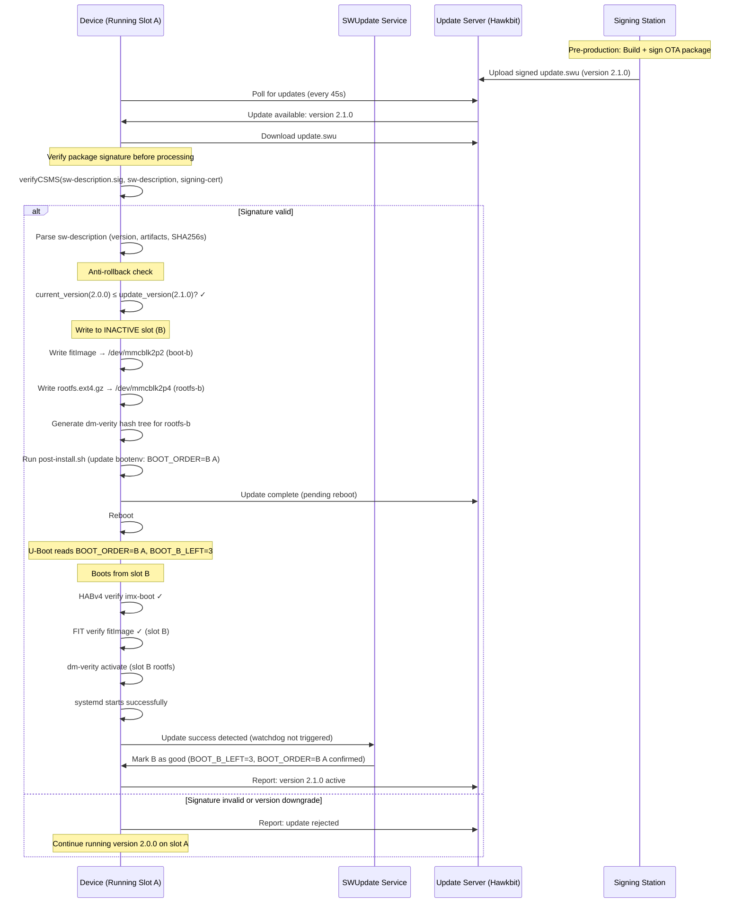

# OTA Update Flow Diagram

## A/B Update Flow with SWUpdate



## Rollback Flow (Boot Failure After Update)

```
U-Boot boot attempt with BOOT_ORDER=B A:

  Attempt 1: BOOT_B_LEFT=3 → boot B (decrements to 2)
    → Kernel panic (bad update) → REBOOT
  
  Attempt 2: BOOT_B_LEFT=2 → boot B (decrements to 1)
    → Kernel panic → REBOOT
  
  Attempt 3: BOOT_B_LEFT=1 → boot B (decrements to 0)
    → Kernel panic → REBOOT
  
  Attempt 4: BOOT_B_LEFT=0 → skip B, try A
    BOOT_A_LEFT=3 → boot A (decrements to 2)
    → Boot succeeds!
  
  SWUpdate (on A) detects boot from A after B failure:
    → Reports failure to update server
    → Server can re-try or hold current version
    → BOOT_A_LEFT restored to 3
```

## Partition Switching

```
Before update (Active = A):
  BOOT_ORDER = A B
  BOOT_A_LEFT = 3 (good)
  BOOT_B_LEFT = 3 (good)
  Active data: boot-a, rootfs-a

After install + reboot (Testing B):
  BOOT_ORDER = B A
  BOOT_A_LEFT = 3 (still good)
  BOOT_B_LEFT = 3 → 2 → 1 → 0 (each boot attempt)

After confirmed good (B active):
  BOOT_ORDER = B A
  BOOT_B_LEFT = 3 (reset to good by rauc/swupdate)
  Active data: boot-b, rootfs-b
```
