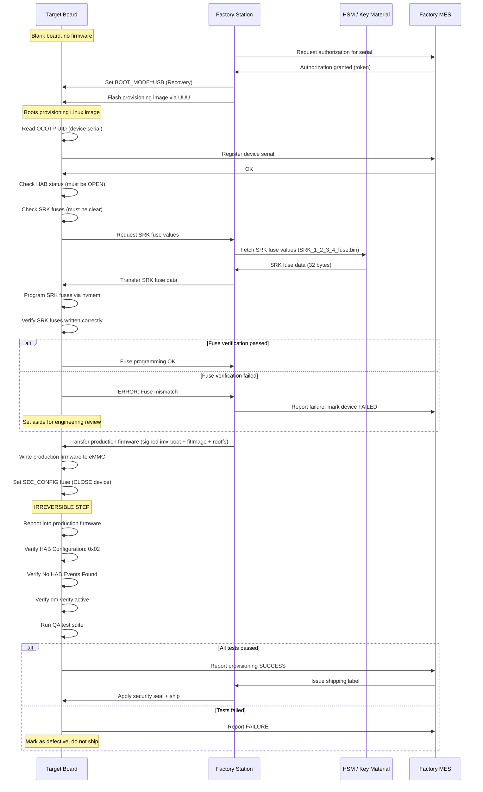

# Provisioning Flow Diagram

## Factory Provisioning Sequence



## Provisioning State Machine

```
RECEIVED ──► AUTHORIZED ──► PROVISIONING_IMAGE_FLASHED
                                │
                                ▼
                          SRK_FUSES_PROGRAMMED
                                │
                         ┌──────┴──────┐
                         │             │
                      (pass)        (fail)
                         │             │
                         ▼             ▼
                  FIRMWARE_FLASHED  FAILED:FUSE_ERROR
                         │
                         ▼
                    DEVICE_CLOSED
                         │
                         ▼
                     QA_TESTING
                         │
                  ┌──────┴──────┐
                  │             │
               (pass)        (fail)
                  │             │
                  ▼             ▼
              SHIPPED      FAILED:QA
```
