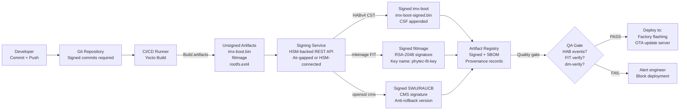

# Signing Pipeline Diagram

## CI/CD Signing Pipeline



## Signing Service Architecture

```
┌──────────────────────────────────────────────────────────────────┐
│                    SIGNING SERVICE                               │
│                                                                  │
│  REST API (mTLS):                                                │
│    POST /sign/habv4    → CST signing                             │
│    POST /sign/fit      → mkimage FIT signing                     │
│    POST /sign/swupdate → openssl cms signing                     │
│    GET  /audit/log     → Signing audit trail                     │
│                                                                  │
│  Authentication:                                                 │
│    OIDC JWT from CI/CD pipeline                                  │
│    or: mTLS client certificate                                   │
│                                                                  │
│  HSM Backend (PKCS#11):                                          │
│    YubiHSM2: slots for CSF key, FIT key, OTA key                │
│    All signing: key never exported, operations in HSM            │
│                                                                  │
│  Audit:                                                          │
│    Every request: timestamp, operator, artifact hash, signature  │
│    Immutable log exported to remote syslog                       │
│    Alert on anomalous patterns (multiple failures, off-hours)    │
│                                                                  │
└──────────────────────────────────────────────────────────────────┘
```

## HABv4 Signing Sub-Pipeline

```
1. Build imx-boot.bin (Yocto output)
   │
2. Determine image parameters:
   ├─ FLASH_SIZE = wc -c < imx-boot.bin
   ├─ PADDED_SIZE = (FLASH_SIZE + 0xFFF) & ~0xFFF
   └─ SPL_LOAD_ADDR (from imx-mkimage output)
   │
3. Generate CSF from template:
   ├─ [Install SRK]  File = SRK_1_2_3_4_table.bin, Index = 0
   ├─ [Install CSFK] File = CSF1_1_..._crt.pem
   ├─ [Authenticate CSF]
   ├─ [Install Key]  File = IMG1_1_..._crt.pem
   └─ [Authenticate Data] Blocks = 0x7E1000 0x000 PADDED_SIZE "imx-boot.bin"
   │
4. Run CST:
   cst -o imxboot_csf.bin -i imxboot_csf.cfg
   │
5. Combine:
   dd if=imx-boot.bin → imx-boot-padded.bin (pad to PADDED_SIZE)
   cat imx-boot-padded.bin imxboot_csf.bin > imx-boot-signed.bin
   │
6. Verify:
   cst --verify imx-boot-signed.bin
```

## FIT Signing Sub-Pipeline

```
1. Build outputs:
   ├─ Image       (kernel binary)
   ├─ *.dtb       (device tree blob)
   └─ initramfs   (optional)

2. Generate dm-verity hash tree:
   veritysetup format rootfs.ext4 rootfs.verity
   ROOT_HASH = $(veritysetup dump | grep "Root hash:")

3. Build ITS with ROOT_HASH in bootargs:
   bootargs = "... systemd.verity_root_hash=ROOT_HASH ..."

4. Build FIT:
   mkimage -f fitimage.its fitimage.bin

5. Sign FIT and embed key in U-Boot DTB:
   mkimage -F fitimage.bin -k keys/fit/ -K u-boot.dtb -r

6. Rebuild U-Boot with updated DTB:
   (U-Boot must be built with -K updated u-boot.dtb)

7. Verify:
   dumpimage -l fitimage.bin | grep "Sign"
   fdtdump u-boot.dtb | grep "key-"
```
